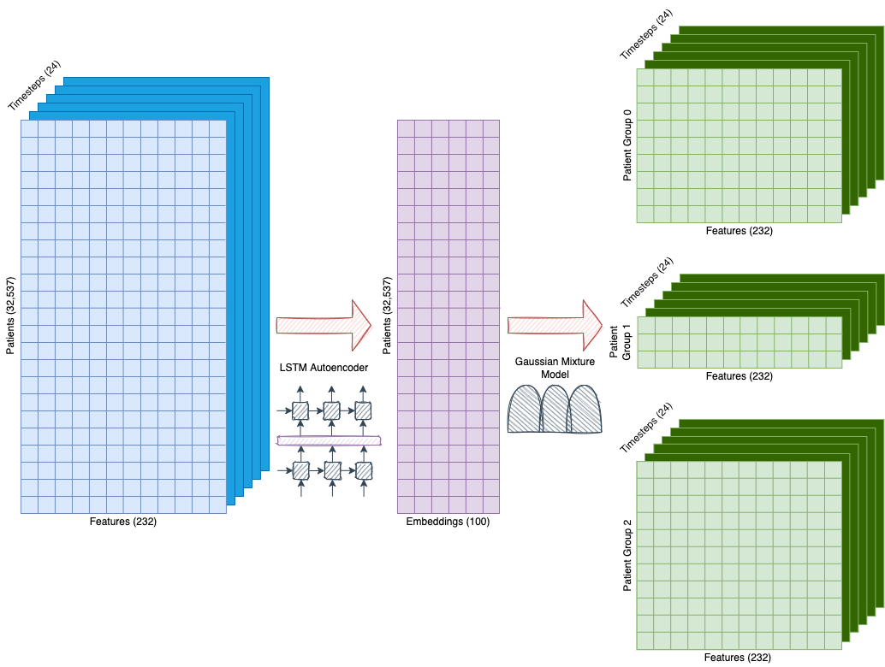

# CS598 Deep Learning for Healthcare Spring 2023 Paper Reproduction Project
##### Gilberto Ramirez and Jay Kakwani 
##### {ger6, kakwani2}@illinois.edu
##### Group ID: 27 | Paper ID: 181
---

## Original Paper

### Citation to the original paper ###

Harini Suresh, Jen J. Gong, and John V. Guttag. 2018. [Learning Tasks for Multitask Learning: Heterogeneous Patient Populations in the ICU](https://arxiv.org/abs/1806.02878). In Proceedings of the 24th ACM SIGKDD International Conference on Knowledge Discovery & Data Mining, KDD ’18, page 802–810, New York, NY, USA. Association for Computing Machinery.

### Link to the original paper's repo ###

https://github.com/mit-ddig/multitask-patients

## Data

This paper uses the publicly available [MIMIC-III database](https://www.nature.com/articles/sdata201635) which contains clinical data in a critical care setting. After reviewing the paper in detail, we decided to use [MIMIC-Extract](https://arxiv.org/abs/1907.08322), an open source pipeline by (Wang et al., 2020) for transforming the raw EHR data into usable Pandas dataframes containing hourly time series of vitals and laboratory measurements after performing unit conversion, outlier handling, and aggregation of semantically similar features.

## Dependencies

You'll need a working Python environment to run our code. The recommended way to set up your environment is through the [Anaconda Python distribution](https://www.anaconda.com/download/) which provides the `conda` package manager. Anaconda can be installed in your user directory and does not interfere with the system Python installation. The required dependencies are specified in the file `environment.yml` inside the cloned github repo folder.

We use `conda` virtual environments to manage the project dependencies in isolation. Thus, you can install our dependencies without causing conflicts with your setup (even if using different Python versions).

Run the following command from the cloned github repo folder (where `environment.yml` is located) to create a separate environment and install all required dependencies in it:

```
conda env create --force -f environment.yml
```

## <a id='data_download_instruction'>Data download instruction</a>

1. Paper reproduction requires access to the MIMIC-III database which can be requested using [this link](https://eicu-crd.mit.edu/gettingstarted/access/).
2. Once access is granted, the MIMIC-III database can be downloaded as a large 6.2 GB zip file from [this link](https://physionet.org/content/mimiciii/get-zip/1.4/).
3. This paper needs two MIMIC-III concept tables, `code_status.csv` and `sapsii.csv`, which can be generated by following the procedure detailed in [the MIMIC-III github repo](https://github.com/MIT-LCP/mimic-code/tree/main/mimic-iii/concepts).
4. Our code uses the results from the MIMIC-Extract pipeline. In particular, a 7.74 GB file called `all_hourly_data.h5`. This file can be either generated following the instructions in the [MIMIC-Extract github](https://github.com/MLforHealth/MIMIC_Extract) or downloading it from [this GCP link](https://console.cloud.google.com/storage/browser/mimic_extract). Access to the GCP bucket can only be obtained if it is credentialed through PhysioNet following [these instructions](https://mimic.mit.edu/docs/gettingstarted/cloud/link/).
5. After getting the three files (`all_hourly_data.h5`, `code_status.csv`, and `sapsii.csv`), move them to the `data` folder inside the cloned github repo folder.

## Code

1. The [`mtl_patients.py` file](https://github.com/ger6-illini/dl4h-sp23-team27-project/blob/main/code/mtl_patients.py) has all methods to pre-process data, generate summaries, discover cohorts and run mortality predictions.
2. [The `cs598-dl4h-team27-paper181.ipynb` notebook](https://github.com/ger6-illini/dl4h-sp23-team27-project/blob/main/notebooks/cs598-dl4h-team27-paper181.ipynb) uses methods in `mtl_patients.py` to preprocess input data (files listed in step 5 in section [data download instruction](#data-download-instruction), create data summaries, train models, evaluate models, and generate results for the two experiments described in the original paper: 24 hours and 48 hours.

## Method

In this paper, the authors propose a novel two-step pipeline to predict in-hospital mortality across patient populations with different characteristics. 

- **Step 1. Discovering Patient Cohorts** by dividing patients into relevant non-overlapping cohorts in an unsupervised way using a long short-term memory (LSTM) autoencoder followed by a Gaussian Mixture Model (GMM).
- **Step 2. Predicts in-hospital mortality** for each patient cohort identified in the previous step using an LSTM based multi-task learning model where every cohort is considered a different task.

### Step 1 Discovering Patient Cohorts

In order to identify meaningful patient cohorts, the paper proposes to process the raw patient data in such a way that the result is a 3D matrix of shape $(P \times T \times F)$ where $P$ represents the number of patients, $T$ the number of timesteps, and $F$ the number of features as depicted in the figure below (in blue) which is partially based on Figure 2 of the original paper. All numbers shown in the figure below correspond to a specific experiment published in the paper in which the observation window is limited to the first $24$ hours (cutoff period) after a patient goes into a careunit and there is a gap of $12$ hours (gap period) between the end of the observation window and the beginning of the prediction window where the prediction task is in-hospital mortality.

Preparation of the data to get the 3D (blue) matrix is performed by a function called `prepare_data()` inside the `mtl_patients.py` module. This preparation consists of the following transformations taken from the paper and the author's code reference implementation:
1. Calculation of the mortality flag (prediction label) and mortality time for every patient in the dataset using an *extended* definition of mortality: death, a note of "Do Not Resuscitate" (DNR), or a note of "Comfort Measures Only" (CMO). In case any of these conditions are met for a patient, the corresponding mortality label is set to *True* and the corresponding mortality time is considered as the earliest time of any of the three conditions. After reviewing in detail the author's code implementation it seems mortality is based on deathtime and a CMO note but not DNR. However, the calculation of the time of death is based on the earliest time of the three conditions.
2. Data used for the prediction is only limited to the first certain amount of hours after a patient goes into the ICU. This amount of hours is called inside the code "a cutoff period" (observation window) and defines the period of data used to train all models. In addition, there is another number of hours called inside the code "the gap period" which represents the time between the end of the observation window and the beginning of the prediction window to prevent label leakage. All patients that died under the *extended* definition before the cutoff period plus the gap period or stayed less than the cutoff period are excluded from the experiment as part of this step. Also, all patients under the age of 15 are excluded (this is already part of the exclusion criteria of the MIMIC-Extract pipeline).
3. There are 29 vitals/labs timeseries selected by the paper. Only data within the cutoff period for vitals/labs is kept and rest is removed. This will be used for the rest of the machine learning pipeline.
4. All vitals/labs values are converted to z-scores so they all have zero mean and unit standard deviation. Those z-scores are rounded to the closest integer and clipped between $-4$ and $4$ or set to $9$ in case of `NaN`. This allows to map every vital/lab measurement (a float) to one of ten possible values $[-4, -3, -2, -1, 0, 1, 2, 3, 4, 9]$, so they can be converted to dummy values. After dummifying the vitals/labs, column for the $9$ values (`NaN`) is removed, and the resulting matrix is sparse and containing either $0$s or $1$s.
5. Every patient is padded with rows of zeroes for those hours that are missed. For example, if a patient only has vitals/labs for the first ten hours and the cutoff period is 24, code adds fourteen hours (rows) with zeroes for that patient. In the end, the matrix will have a size of $P \times T \times F$ as expected by the subsequent models.
6. Finally, static data (gender, age, and ethnicity) is converted to integers representing categories and dummified. In case of age, there are four buckets established; $(10, 30), (30, 50), (50, 70), (70, \infty)$; while ethnicity is broken into five buckets (asian, white, hispanic, black, other).
7. Cohort assignments based on first careunit or Simplified Acute Physiology Score (SAPS) II score quartile is calculated for each patient and returned as well.



The `discover_cohorts()` function inside the `mtl_patients.py` module is the one implementing the pipeline shown in the figure above and then calling the `prepare_data()` function detailed previously as the first step. Once data has been processed, the function will break the data in training, validation, and test data sets in a $70\%/10\%/20\%$ proportion.

The training data is used to train an LSTM autoencoder. The main purpose of the LSTM autoencoder is to generate a fixed-length dense representation (embedding) of the sparse inputs trying to retain the most important parts of the inputs. The paper selected embeddings of size $50$ as the optimal dimension (hyperparameter). The purple box in the middle of the diagram above (a 2D matrix) represents the embeddings after the LSTM autoencoder learned the representation of the original 3D matrix of shape $(32537 \times 24 \times 232)$ where every row corresponds to a patient.

Once the embeddings are calculated, a Gaussian Mixture Model is applied using $3$ clusters (the value the authors considered optimal). The result are the three green boxes representing three cohorts discovered in an unsupervised way and grouping similar patients based on the three static and the 29 time-varying vitals/labs selected from the MIMIC-III database.

### Step 2 Predicting In-Hospital Mortality

As mentioned in the previous section, the paper uses a two-step pipeline to: 1) identify relevant patient cohorts, and 2) use those relevant cohorts as separate tasks in a multi-lask learning framework to predict in-hospital mortality. In this section, we will focus on the second step of the pipeline, i.e., use multi-task learning to make in-hospital mortality predictions for different patient cohorts.

The second step uses as input the result from the first step which is a series of 3D matrices, one per discovered cohort, of shape $(P \times T \times F)$ where $P$ represents the number of patients, $T$ the number of timesteps, and $F$ the number of features. As an example, the 24 hour experiment described by the authors in the paper and reproduced in the previous section resulted in three cohorts (clusters) called group 0, group 1, and group 2 where the shapes of the corresponding 3D matrices are:
* $14120 \times 24 \times 232$ for group 0,
* $10841 \times 24 \times 232$ for group 1, and
* $7752 \times 24 \times 232$ for group 2.

To convert these matrices into predictions, the paper proposes an LSTM for all model configurations including the baseline. In particular, the paper shows results from two specific models: a baseline model that is called *global* and using single-task learning and the multi-task learning model the authors claim as superior to the baseline.

A diagram of the baseline (*global*) model proposed by the authors is shown below. As it can be seen, this model consists of an LSTM layer of 16 cells using a RELU activation function followed by a *single* dense layer with a sigmoid activation function. The result of the dense (fully-connected) layer is an estimate of the probability of in-hospital mortality for a given patient. This baseline model is trained with all patient samples regardless the cohort, hence the name *global*, and used for per cohort predictions.


Moving to the second model and the one the authors claim it provides benefits against the baseline is the so called *multi-task learning model*. This model consists of an LSTM layer with same number of cells (16) as the baseline model, to ensure the comparison is fair, connected to as many dense layers as population subgroups (cohorts). Each of these cohorts is considered a *task* and authors propose training these models on multiple tasks simultaneously in contrast to the baseline model with just one dense layer. The benefit of this approach according to the authors is the ability to share knowledge learned from one task (cohort) to rest of tasks under the assumption that the subpopulations used are distinct enough with relation to the outcome learned (mortality) that such shared knowledge truly exists. A representation of the multi-task learning model is shown below:


For benchmarking purposes of the entire pipeline, the authors compared the results from running the pipeline using unsupervised cohort discovery (step one) against cohorts created using the first careunit the patient went into which can be considered an engineered feature. We will show those results in the next subsections.

The overall performance of this model is measured using both macro and micro metrics (section 4.3 in the paper) where:
* In *micro* metrics all predicted probabilities for all patients are treated as if they come from a single classifier: $\text{Metric}_\text{Micro} = \text{Metric}([\hat{y}_0, ..., \hat{y}_k], [y_0, ..., y_K])$.
* In *macro* metrics probabilities are evaluated on a *per cohort* basis, and then averaged: $Metric_{\text{Macro}} =\dfrac{1}{K} \displaystyle\sum_{k=0}^k Metric(\hat{y}_k,y_k)$.

Paper suggests that, although micro metrics are the ones typically chosen in the literature, evaluating performance on different subpopulations will benefit from macro metrics instead of micro metrics specially when there is class imbalance in every cohort. All results show macro and micro versions of the metrics for the aggregate performance of the models.

All results being used for comparison between models by the paper will use three metrics:
* AUC (Area Under the ROC Curve) for every cohort and, for the aggregate performance, macro and micro.
* PPV (Positive Predictive Value which is same as Precision) for every cohort and, for the aggregate performance, macro and micro. This PPV is calculated at a sensitivity of 80%, a value selected by the paper authors.
* Specificity for every cohort and, for the aggregate performance, macro and micro. This specificity is calculated at a sensitivity of 80%, a value selected by the paper authors.

All in-hospital mortality prediction tasks are implemented using the function `run_mortality_prediction_task()`. This function will call other functions to prepare the data, split the data in training/validation/test data sets, train the corresponding model, predict using the resulting model, and calculate the metrics of the model.

## Results

### Paper Reproduction Result

24 Hours and 48 hours Mortality Prediction experiment shows performance differences between multi-task and global models on specific cohorts.
Significant differences (p < 0.01) are shown in bold.


### Results Comparison 

#### 1. Original Paper (Table 4) - 24 Hours Mortality Prediction 


#### 2. Original Paper (Table 5) - 48 Hours Mortality Prediction 


